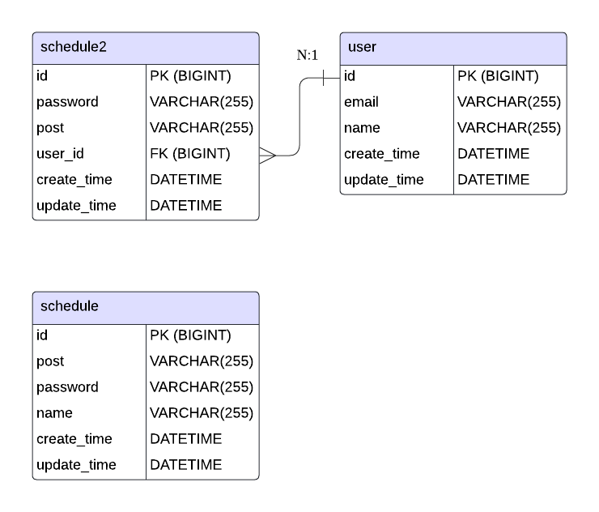

# Schedule API
| 기능       | Method | URL             | parameter                              | request                                               | response                                                                                                      | 상태코드    |
|----------|--------|-----------------|----------------------------------------|-------------------------------------------------------|---------------------------------------------------------------------------------------------------------------|---------|
| 일정 작성    | POST   | /schedules      | X                                      | {"post": string, "password": string, "email": string} | {"id": string, "post": string, "name": string, "email": string, "create_time": string, "update_time": string} | 200 OK  |
| 전체 일정 조회 | GET    | /schedules      | update_time, name, id, page, page_size | X                                                     | {"id": string, "post": string, "name": string, "email": string, "create_time": string, "update_time": string} | 200 OK  |
| 선택 일정 조회 | GET    | /schedules/{id} | id                                     | X                                                     | {"id": string, "post": string, "name": string, "email": string, "create_time": string, "update_time": string} | 200 OK  |
| 선택 일정 수정 | PUT    | /schedules/{id} | id                                     | {"post": string, "password": string, "email": string} | {"id": string, "post": string, "name": string, "email": string, "create_time": string, "update_time": string} | 200 OK  |
| 선택 일정 삭제 | DELETE | /schedules/{id} | id, password                           | X                                                     | X                                                                                                             | 200 O K |

# User API
| 기능       | Method | URL             | parameter | request                             | response                                                                                      | 상태코드   |
|----------|--------|-----------------|-----------|-------------------------------------|-----------------------------------------------------------------------------------------------|--------|
| 유저 생성    | POST   | /users      | X         | {"name": string, "email": string}   | {"id": string, "name": string, "email": string, "create_time": string, "update_time": string} | 200 OK |
| 선택 유저 조회 | GET    | /users/{id} | id        | X                                   | {"id": string, "name": string, "email": string, "create_time": string, "update_time": string} | 200 OK |
| 선택 유저 수정 | PUT    | /users/{id} | id        | {"name": string, "email": string}   | {"id": string, "name": string, "email": string, "create_time": string, "update_time": string} | 200 OK |
| 선택 유저 삭제 | DELETE | /users/{id} | id        | X                                   | X                                                                                             | 200 OK |

# ERD
